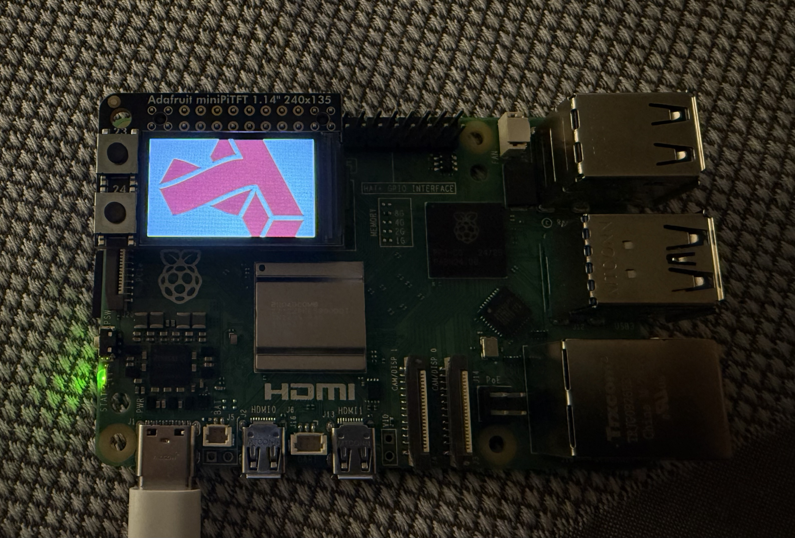
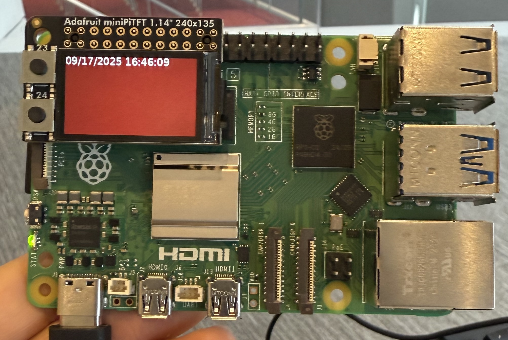
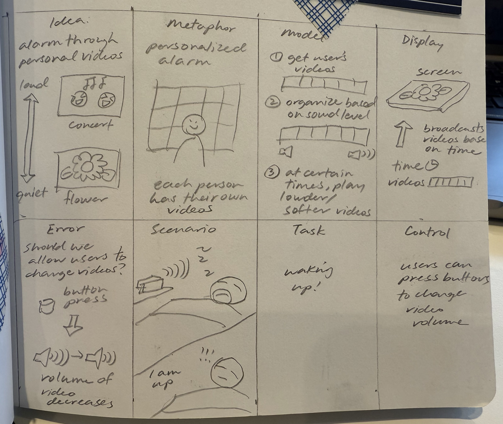

# Interactive Prototyping: The Clock of Pi
**NAMES OF COLLABORATORS HERE**

<details>
<summary>Toggle original details</summary>
Does it feel like time is moving strangely during this semester?

For our first Pi project, we will pay homage to the [timekeeping devices of old](https://en.wikipedia.org/wiki/History_of_timekeeping_devices) by making simple clocks.

It is worth spending a little time thinking about how you mark time, and what would be useful in a clock of your own design.

**Please indicate anyone you collaborated with on this Lab here.**
Be generous in acknowledging their contributions! And also recognizing any other influences (e.g. from YouTube, Github, Twitter) that informed your design. 

## Prep

Lab Prep is extra long this week. Make sure to start this early for lab on Thursday.

1. ### Set up your Lab 2 Github

Before the start of lab Thursday, ensure you have the latest lab content by updating your forked repository. 

**📖 [Follow the step-by-step guide for safely updating your fork](pull_updates/README.md)**

This guide covers how to pull updates without overwriting your completed work, handle merge conflicts, and recover if something goes wrong.


2. ### Get Kit and Inventory Parts
Prior to the lab session on Thursday, taken inventory of the kit parts that you have, and note anything that is missing:

***Update your [parts list inventory](partslist.md)***
Done ✅

3. ### Prepare your Pi for lab this week
[Follow these instructions](prep.md) to download and burn the image for your Raspberry Pi before lab Thursday.

</details>


## Overview
For this assignment, you are going to 

A) [Connect to your Pi](#part-a)  

B) [Try out cli_clock.py](#part-b) 

C) [Set up your RGB display](#part-c)

D) [Try out clock_display_demo](#part-d) 

E) [Modify the code to make the display your own](#part-e)

F) [Make a short video of your modified barebones PiClock](#part-f)

G) [Sketch and brainstorm further interactions and features you would like for your clock for Part 2.](#part-g)

<details>
<summary>Toggle original details</summary>
## The Report
This readme.md page in your own repository should be edited to include the work you have done. You can delete everything but the headers and the sections between the \*\*\***stars**\*\*\*. Write the answers to the questions under the starred sentences. Include any material that explains what you did in this lab hub folder, and link it in the readme.

Labs are due on Mondays. Make sure this page is linked to on your main class hub page.
</details>

## Part A. 
### Connect to your Pi

<details>
<summary>Toggle original details</summary>
Just like you did in the lab prep, ssh on to your pi. Once you get there, create a Python environment (named venv) by typing the following commands.

```
ssh pi@<your Pi's IP address>
...
pi@raspberrypi:~ $ python -m venv venv
pi@raspberrypi:~ $ source venv/bin/activate
(venv) pi@raspberrypi:~ $ 

```
### Setup Personal Access Tokens on GitHub
Set your git name and email so that commits appear under your name.
```
git config --global user.name "Your Name"
git config --global user.email "yourNetID@cornell.edu"
```

The support for password authentication of GitHub was removed on August 13, 2021. That is, in order to link and sync your own lab-hub repo with your Pi, you will have to set up a "Personal Access Tokens" to act as the password for your GitHub account on your Pi when using git command, such as `git clone` and `git push`.

Following the steps listed [here](https://docs.github.com/en/authentication/keeping-your-account-and-data-secure/managing-your-personal-access-tokens) from GitHub to set up a token. Depends on your preference, you can set up and select the scopes, or permissions, you would like to grant the token. This token will act as your GitHub password later when you use the terminal on your Pi to sync files with your lab-hub repo.
</details>

## Part B. 
### Try out the Command Line Clock
<details>
<summary>Toggle original details</summary>
Clone your own lab-hub repo for this assignment to your Pi and change the directory to Lab 2 folder (remember to replace the following command line with your own GitHub ID):

```
(venv) pi@raspberrypi:~$ git clone https://github.com/<YOURGITID>/Interactive-Lab-Hub.git
(venv) pi@raspberrypi:~$ cd Interactive-Lab-Hub/Lab\ 2/
```
Depends on the setting, you might be asked to provide your GitHub user name and password. Remember to use the "Personal Access Tokens" you just set up as the password instead of your account one!

Check if the directory has clone sucessfully, you should see the Interactive-Lab-Hub under the home directory listed:
```
(venv) pi@raspberrypi:~ $ ls
Bookshelf      Documents            Music     Public                 venv
create_img.sh  Downloads            pi-apps   screen_boot_script.py  Videos
Desktop        Interactive-Lab-Hub  Pictures  Templates
(venv) pi@raspberrypi:~ $
```


Install the packages from the requirements.txt and run the example script `cli_clock.py`:

```
(venv) pi@raspberrypi:~/Interactive-Lab-Hub/Lab 2 $ pip install -r requirements.txt
(venv) pi@raspberrypi:~/Interactive-Lab-Hub/Lab 2 $ python cli_clock.py 
02/24/2021 11:20:49
```

The terminal should show the time, you can press `ctrl-c` to exit the script.
If you are unfamiliar with the Python code in `cli_clock.py`, have a look at [this Python refresher](https://hackernoon.com/intermediate-python-refresher-tutorial-project-ideas-and-tips-i28s320p). If you are still concerned, please reach out to the teaching staff!
</details>

## Part C. 
### Set up your RGB Display
<details>
<summary>Toggle original details</summary>
  
We have asked you to equip the [Adafruit MiniPiTFT](https://www.adafruit.com/product/4393) on your Pi in the Lab 2 prep already. Here, we will introduce you to the MiniPiTFT and Python scripts on the Pi with more details.


The Raspberry Pi 4 has a variety of interfacing options. When you plug the pi in the red power LED turns on. Any time the SD card is accessed the green LED flashes. It has standard USB ports and HDMI ports. Less familiar it has a set of 20x2 pin headers that allow you to connect a various peripherals.


To learn more about any individual pin and what it is for go to [pinout.xyz](https://pinout.xyz/pinout/3v3_power) and click on the pin. Some terms may be unfamiliar but we will go over the relevant ones as they come up.

### Hardware (you have already done this in the prep)

From your kit take out the display and the [Raspberry Pi 5](https://www.google.com/url?sa=i&url=https%3A%2F%2Fwww.raspberrypi.com%2Fproducts%2Fraspberry-pi-5%2F&psig=AOvVaw330s4wIQWfHou2Vk3-0jUN&ust=1757611779758000&source=images&cd=vfe&opi=89978449&ved=0CBMQjRxqFwoTCPi1-5_czo8DFQAAAAAdAAAAABAE)

Line up the screen and press it on the headers. The hole in the screen should match up with the hole on the raspberry pi.

<p float="left">


</p>
</details>

### Testing your Screen
<details>
<summary>Toggle original details</summary>
  
The display uses a communication protocol called [SPI](https://www.circuitbasics.com/basics-of-the-spi-communication-protocol/) to speak with the raspberry pi. We won't go in depth in this course over how SPI works. The port on the bottom of the display connects to the SDA and SCL pins used for the I2C communication protocol which we will cover later. GPIO (General Purpose Input/Output) pins 23 and 24 are connected to the two buttons on the left. GPIO 22 controls the display backlight.

To show you the IP and Mac address of the Pi to allow connecting remotely we created a service that launches a python script that runs on boot. For the following steps stop the service by typing ``` sudo systemctl stop piscreen.service --now```. Othwerise two scripts will try to use the screen at once. You may start it again by typing ``` sudo systemctl start piscreen.service --now```

We can test it by typing 
```
(venv) pi@raspberrypi:~/Interactive-Lab-Hub/Lab 2 $ python screen_test.py
```

You can type the name of a color then press either of the buttons on the MiniPiTFT to see what happens on the display! You can press `ctrl-c` to exit the script. Take a look at the code with
```
(venv) pi@raspberrypi:~/Interactive-Lab-Hub/Lab 2 $ cat screen_test.py
```
</details>

[Video of screen_test.py result](https://drive.google.com/file/d/1XdDcl6X8U7lxhQ272n5ZM5QA64STngPx/view?usp=sharing)

#### Displaying Info with Texts
You can look in `screen_boot_script.py` for how to display text on the screen!

#### Displaying an image

You can look in `image.py` for an example of how to display an image on the screen. Can you make it switch to another image when you push one of the buttons?



## Part D. 
### Set up the Display Clock Demo
Work on `screen_clock.py`, try to show the time by filling in the while loop (at the bottom of the script where we noted "TODO" for you). You can use the code in `cli_clock.py` and `stats.py` to figure this out.

Relevant code is contained here:
```
while True:
    # Draw a black filled box to clear the image.
    draw.rectangle((0, 0, width, height), outline=0, fill=400)

    #TODO: Lab 2 part D work should be filled in here. You should be able to look in cli_clock.py and stats.py 
    
    # code from stats.py
    padding = -2
    top = padding
    bottom = height - padding
    x = 0
    y = top

    # code from cli_clock.py
    draw.text((x, y), strftime("%m/%d/%Y %H:%M:%S"), font=font, fill="#FFFFFF")

    # Display image.
    disp.image(image, rotation)
    time.sleep(1)
```



### How to Edit Scripts on Pi
<details>
<summary>Toggle original details</summary>
Option 1. One of the ways for you to edit scripts on Pi through terminal is using [`nano`](https://linuxize.com/post/how-to-use-nano-text-editor/) command. You can go into the `screen_clock.py` by typing the follow command line:
```
(venv) pi@raspberrypi:~/Interactive-Lab-Hub/Lab 2 $ nano screen_clock.py
```
You can make changes to the script this way, remember to save the changes by pressing `ctrl-o` and press enter again. You can press `ctrl-x` to exit the nano mode. There are more options listed down in the terminal you can use in nano.

Option 2. Another way for you to edit scripts is to use VNC on your laptop to remotely connect your Pi. Try to open the files directly like what you will do with your laptop and edit them. Since the default OS we have for you does not come up a python programmer, you will have to install one yourself otherwise you will have to edit the codes with text editor. [Thonny IDE](https://thonny.org/) is a good option for you to install, try run the following command lines in your Pi's ternimal:

  ```
  pi@raspberrypi:~ $ sudo apt install thonny
  pi@raspberrypi:~ $ sudo apt update && sudo apt upgrade -y
  ```

Now you should be able to edit python scripts with Thonny on your Pi.

Option 3. A nowadays often preferred method is to use Microsoft [VS code to remote connect to the Pi](https://www.raspberrypi.com/news/coding-on-raspberry-pi-remotely-with-visual-studio-code/). This gives you access to a fullly equipped and responsive code editor with terminal and file browser.  

Pro Tip: Using tools like [code-server](https://coder.com/docs/code-server/latest) you can even setup a VS Code coding environment hosted on your raspberry pi and code through a web browser on your tablet or smartphone! 
</details>

## Part G. 
## Sketch and brainstorm further interactions and features you would like for your clock for Part 2.

I expanded on an idea for my clock using the Verplank diagram. I envisioned that it would be an alarm that used the videos in your camera roll to wake you up. Normally, it would play ambient videos, but if you set an alarm it would play your loudest video, and subsequent snoozes would make the next video played a little quieter.



Feedback: 
- Kyle said that he would want the alarm to get louder, instead of quieter; if the first video didn't wake him up, the subsequent videos definitely wouldn't. This is a good point and a reason why I should've gotten feedback earlier because I assumed the opposite--- that the clock would reward the user snoozing it by getting quieter.
- Jesse said that she would want the clock to also have the time on it, which is a really good point 😭

# Lab 2 Part 2

## Assignment that was formerly Lab 2 Part E.
### Modify the barebones clock to make it your own

Does time have to be linear?  How do you measure a year? [In daylights? In midnights? In cups of coffee?](https://www.youtube.com/watch?v=wsj15wPpjLY)

Can you make time interactive? You can look in `screen_test.py` for examples for how to use the buttons.

Please sketch/diagram your clock idea. (Try using a [Verplank diagram](https://ccrma.stanford.edu/courses/250a-fall-2004/IDSketchbok.pdf))!

**We strongly discourage and will reject the results of literal digital or analog clock display.**

\*\*\***A copy of your code should be in your Lab 2 Github repo.**\*\*\*

I started by trying to make bluetooth audio work. This was quite an ordeal and took longer than it should've because we weren't provided the speaker's model name at the time, so in the end I connected it to my personal speaker. Code for this is in `bluetooth_connect.py` and below:

```
# code from https://chatgpt.com/share/68d1a454-700c-800d-97b9-185324e69dee

#!/usr/bin/env python3
import subprocess
import time

JBL_MAC = "D8:37:3B:84:AA:F1"  # JBL Flip 5

def connect_device(mac):
    """Pair, trust, and connect to a Bluetooth device by MAC address."""
    print(f"Connecting to JBL Flip 5 ({mac})...")

    commands = [
        "power on",
        "agent on",
        "default-agent",
        f"pair {mac}",
        f"trust {mac}",
        f"connect {mac}",
        "quit"
    ]

    process = subprocess.Popen(
        ["bluetoothctl"],
        stdin=subprocess.PIPE,
        stdout=subprocess.PIPE,
        stderr=subprocess.PIPE,
        text=True,
    )

    for cmd in commands:
        print(f"> {cmd}")
        process.stdin.write(cmd + "\n")
        process.stdin.flush()
        # wait a bit after each command so bluetoothctl can respond
        time.sleep(2)

    process.stdin.close()
    process.wait()
    print("Finished connecting process. If successful, audio will now route to your JBL Flip 5.")

if __name__ == "__main__":
    connect_device(JBL_MAC)
```

After I got bluetooth audios to play, I had to make videos play on my pi screen. This was another ordeal and a few libraries didn't work before `cv2` finally worked. Relevant code in `video.py` and below: 

```
import subprocess
import cv2
from PIL import Image
import digitalio, board
import adafruit_rgb_display.st7789 as st7789
import os, glob, re, time, datetime

# ---------------------------
# Setup Display
# ---------------------------
cs_pin = digitalio.DigitalInOut(board.D5)
dc_pin = digitalio.DigitalInOut(board.D25)
reset_pin = digitalio.DigitalInOut(board.D24)
BAUDRATE = 24000000
spi = board.SPI()
disp = st7789.ST7789(
    spi, cs=cs_pin, dc=dc_pin, rst=reset_pin,
    baudrate=BAUDRATE, width=135, height=240,
    x_offset=53, y_offset=40,
)

# Backlight
backlight = digitalio.DigitalInOut(board.D22)
backlight.switch_to_output(value=True)

# ---------------------------
# Buttons
# ---------------------------
buttonA = digitalio.DigitalInOut(board.D23)  # next video
buttonA.switch_to_input(pull=digitalio.Pull.UP)

# ---------------------------
# Video Scan + Loudness Ranking
# ---------------------------
VIDEO_DIR = "./videos"
VIDEO_EXTENSIONS = ("*.mp4", "*.mov", "*.MOV", "*.avi", "*.mkv")

video_files = []
for ext in VIDEO_EXTENSIONS:
    video_files.extend(glob.glob(os.path.join(VIDEO_DIR, ext)))

if not video_files:
    print("No videos found in", VIDEO_DIR)
    exit(1)

def get_max_volume(video_path):
    """Return max_volume in dB (closer to 0 = louder)."""
    try:
        cmd = [
            "ffmpeg", "-i", video_path,
            "-af", "volumedetect", "-f", "null", "-"
        ]
        result = subprocess.run(
            cmd, stderr=subprocess.PIPE, stdout=subprocess.PIPE, text=True
        )
        matches = re.findall(r"max_volume: (-?\d+(\.\d+)?) dB", result.stderr)
        if matches:
            return float(matches[-1][0])
    except Exception as e:
        print(f"Error analyzing {video_path}: {e}")
    return -9999.0

# Rank videos loudest → quietest
ranked_videos = sorted(video_files, key=get_max_volume, reverse=True)
print("Videos ranked by loudness:")
for i, v in enumerate(ranked_videos):
    print(f"{i+1}. {v}")

# ---------------------------
# Video Playback Function
# ---------------------------
def play_video(video_path):
    print(f"Playing: {video_path}")
    # Start audio in background
    audio_proc = subprocess.Popen([
        "ffplay", "-nodisp", "-autoexit", "-loglevel", "quiet", video_path
    ])

    cap = cv2.VideoCapture(video_path)
    while cap.isOpened():
        ret, frame = cap.read()
        if not ret:
            break

        # Convert and display
        frame = cv2.cvtColor(frame, cv2.COLOR_BGR2RGB)
        image = Image.fromarray(frame)

        # Resize/crop for screen
        if disp.rotation % 180 == 90:
            height, width = disp.width, disp.height
        else:
            width, height = disp.width, disp.height

        image_ratio = image.width / image.height
        screen_ratio = width / height
        if screen_ratio < image_ratio:
            scaled_width = image.width * height // image.height
            scaled_height = height
        else:
            scaled_width = width
            scaled_height = image.height * width // image.width
        image = image.resize((scaled_width, scaled_height), Image.BICUBIC)
        x = scaled_width // 2 - width // 2
        y = scaled_height // 2 - height // 2
        image = image.crop((x, y, x + width, y + height))

        disp.image(image)

        # Button check (break early to switch video)
        if buttonA.value == False:  # button pressed (active-low)
            print("Button pressed -> switching video")
            cap.release()
            audio_proc.terminate()
            return "next"

    cap.release()
    audio_proc.wait()
    return "done"

# ---------------------------
# Main Loop
# ---------------------------
TARGET_TIME = "16:00"  # <-- set target time (HH:MM 24hr)

started = False
video_index = 0

print(f"Waiting until {TARGET_TIME} to play loudest video...")

while True:
    now = datetime.datetime.now().strftime("%H:%M")

    if not started and now == TARGET_TIME:
        started = True
        video_index = 0
        play_video(ranked_videos[video_index])

    if started:
        # If button is pressed, cycle through next loudest
        if buttonA.value == False:  # active-low
            video_index = (video_index + 1) % len(ranked_videos)
            time.sleep(0.3)  # debounce
            play_video(ranked_videos[video_index])

    time.sleep(0.2)
```

I also made a `p5.js` clock when my original plan wasn't working--- I wasn't able to successfully stream the result of the code to the Raspberry Pi due to additional issues with streaming graphics to the Pi screen but related code is in the folder `p5_clock`. I made it so that the visuals (the evolving flower-looking thing) change based on the hours, minutes, and seconds.

The video of the p5.js clock is here:
[p5 video link](https://drive.google.com/file/d/1vKhWz4nccW9D8cje88vVp7By-ENjp4T0/view?usp=drive_link)

And relevant code is here:

```
function setup() {
	createCanvas(400, 200);
  }
  
  function draw() {
	background(220);
	
	let hr = hour();
	let mn = minute();
	let sc = second();
	let date = new Date();
	let ms = date.getMilliseconds();
	
	push();
	// noFill();
	fill(0,50)
	noStroke()
	translate(200, 100);
	for (let i = 0; i < 10; i++) {
	  ellipse(hr, mn, ms, hr);
	  rotate(PI / max(1, sc));
	}
	pop();
	let formattedHr = nf(hr, 2);
	let formattedMn = nf(mn, 2);
	let formattedSc = nf(sc, 2);
  
	let timeString = formattedHr + ":" + formattedMn + ":" + formattedSc;
	
  
	push();
	  drawingContext.save();
	drawingContext.globalCompositeOperation = 'difference';
	fill(255);
	textSize(60);
	textAlign(CENTER, CENTER);
	text(timeString, width / 2, height / 2); // Display time in the center
	pop();
	
	blendMode(BLEND);
  }
```

## Assignment that was formerly Part F. 
## Make a short video of your modified barebones PiClock

\*\*\***Take a video of your PiClock.**\*\*\*

[PiClock video link](https://drive.google.com/file/d/173PboCtEup-2P6rF18AwAPX2pRk6RKqU/view?usp=drive_link)

After you edit and work on the scripts for Lab 2, the files should be upload back to your own GitHub repo! You can push to your personal github repo by adding the files here, commiting and pushing.

```
(venv) pi@raspberrypi:~/Interactive-Lab-Hub/Lab 2 $ git add .
(venv) pi@raspberrypi:~/Interactive-Lab-Hub/Lab 2 $ git commit -m 'your commit message here'
(venv) pi@raspberrypi:~/Interactive-Lab-Hub/Lab 2 $ git push
```

After that, Git will ask you to login to your GitHub account to push the updates online, you will be asked to provide your GitHub user name and password. Remember to use the "Personal Access Tokens" you set up in Part A as the password instead of your account one! Go on your GitHub repo with your laptop, you should be able to see the updated files from your Pi!


[Update your Lab Hub](pull_updates/README.md) to get the latest content and requirements for Part 2.

Modify the code from last week's lab to make a new visual interface for your new clock. You may [extend the Pi](Extending%20the%20Pi.md) by adding sensors or buttons, but this is not required.

As always, make sure you document contributions and ideas from others explicitly in your writeup.

You are permitted (but not required) to work in groups and share a turn in; you are expected to make equal contribution on any group work you do, and N people's group project should look like N times the work of a single person's lab. What each person did should be explicitly documented. Make sure the page for the group turn in is linked to your Interactive Lab Hub page. 


