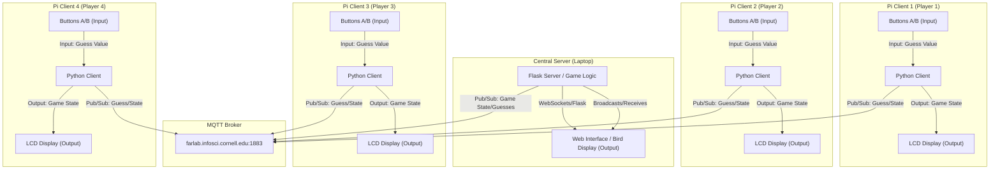
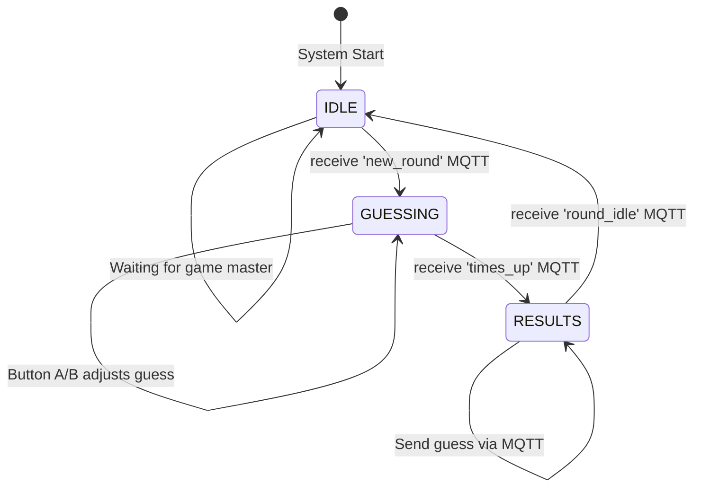

# Distributed Interaction

**NAMES OF COLLABORATORS HERE** : Kyle Li (kl2296), Jesse Iriah (ji227), Nophar Shalom (ns2242)

For submission, replace this section with your documentation!

---

## Prep

1. Pull the new changes
2. Read: [The Presence Table](https://dl.acm.org/doi/10.1145/1935701.1935800) ([video](https://vimeo.com/15932020))

## Overview

Build interactive systems where **multiple devices communicate over a network** using MQTT messaging. Work in teams of 3+ with Raspberry Pis.

**Parts:**
- A: Learn MQTT messaging
- B: Try collaborative pixel grid demo  
- C: Build your own distributed system

---

## Part A: MQTT Messaging

MQTT = lightweight messaging for IoT. Publish/subscribe model with central broker.

**Concepts:**
- **Broker**: `farlab.infosci.cornell.edu:1883`
- **Topic**: Like `IDD/bedroom/temperature` (use `#` wildcard)
- **Publish/Subscribe**: Send and receive messages

**Install MQTT tools on your Pi:**
```bash
sudo apt-get update
sudo apt-get install -y mosquitto-clients
```

**Test it:**

**Subscribe to messages (listener):**
```bash
mosquitto_sub -h farlab.infosci.cornell.edu -p 1883 -t 'IDD/#' -u idd -P 'device@theFarm'
```

**Publish a message (sender):**
```bash
mosquitto_pub -h farlab.infosci.cornell.edu -p 1883 -t 'IDD/test/yourname' -m 'Hello!' -u idd -P 'device@theFarm'
```

> **💡 Tips:**
> - Replace `yourname` with your actual name in the topic
> - Use single quotes around the password: `'device@theFarm'`

**🔧 Debug Tool:** View all MQTT messages in real-time at `http://farlab.infosci.cornell.edu:5001`


**💡 Brainstorm 5 ideas for messaging between devices**


---

## Part B: Collaborative Pixel Grid

Each Pi = one pixel, controlled by RGB sensor, displayed in real-time grid.

**Architecture:** `Pi (sensor) → MQTT → Server → Web Browser`

**Setup:**

1. **Server** (one person on laptop):
```bash
cd "Lab 6"  
source .venv/bin/activate
pip install -r requirements-server.txt
python app.py
```

2. **View in browser:**
   - Grid: `http://farlab.infosci.cornell.edu:5000`
   - Controller: `http://farlab.infosci.cornell.edu:5000/controller`

3. **Pi publisher** (everyone on their Pi):
```bash
# First time setup - create virtual environment
cd "Lab 6"
python -m venv .venv
source .venv/bin/activate
pip install -r requirements-pi.txt

# Run the publisher
python pixel_grid_publisher.py
```

Hold colored objects near sensor to change your pixel!


**📸 Include: Screenshot of grid + photo of your Pi setup**


[Video of grid and pi](https://drive.google.com/file/d/19x196xLCY41LF83rwQdQdu9hYiAdSO1-/view?usp=drive_link)

---

## Part C: Make Your Own

**Requirements:**
- 3+ people, 3+ Pis
- Each Pi contributes sensor input via MQTT
- Meaningful or fun interaction

### Deliverables

Replace this README with your documentation:

**1. Project Description (What does it do? Why interesting? User experience?)**

Kyle initially proposed doing something similar to [Nintendo's Box Counting game](https://youtu.be/9PZazcFJEvk), where players are given an arrangement of cubes and are asked to count them within a short time limit. We talked about the idea, and decided to make a similar game where competing players (acting as teachers) must count the number of students that appear on screen before the time runs out, and that the person with the most accurate guess wins.

**2. Architecture Diagram (Hardware, connections, data flow, Label input/computation/output)**


### Architecture Diagram


### State Diagram



**3. Build Documentation**

**Photos of each Pi + sensors**


This is a screenshot of the Pi clients connecting to the server and submitting their final guesses.

**MQTT topics used**

This is the configuration we used for MQTT

```
MQTT_BROKER = 'farlab.infosci.cornell.edu'
MQTT_PORT = 1883
MQTT_USERNAME = 'idd'
MQTT_PASSWORD = 'device@theFarm'

MQTT_TOPIC_PREFIX = 'IDD/studentgame'
MQTT_TOPIC_REGISTER = f'{MQTT_TOPIC_PREFIX}/client/register'
MQTT_TOPIC_SUBMIT_GUESS = f'{MQTT_TOPIC_PREFIX}/client/submit_guess'

MQTT_TOPIC_NEW_ROUND = f'{MQTT_TOPIC_PREFIX}/broadcast/new_round'
MQTT_TOPIC_TIMES_UP = f'{MQTT_TOPIC_PREFIX}/broadcast/times_up'
MQTT_TOPIC_ROUND_IDLE = f'{MQTT_TOPIC_PREFIX}/broadcast/round_idle'
```

From the server side, `IDD/birdgame/broadcast/new_round` was used to start a new round, `IDD/birdgame/broadcast/times_up` was used to end guessing, and `IDD/birdgame/broadcast/round_idle` was used to return to the idle state. On the Pi/client side, `IDD/birdgame/client/register` was used to register Pis with the MAC address, and `IDD/birdgame/client/submit_guess` was used to submit guesses.

**Message format**
```
// Registration
{"mac": "2c:cf:67:df:5c:03"}

// Guess submission
{"mac": "2c:cf:67:df:5c:03", "guess": 34}
```

**Implementation**

The `count.py` file contains the central server code that connects to the Pi clients and displays the screen where players have to count students from. 

Once a game is started, the central server communicates to the Pis that a new round has started, the correct answer (which is a number randomly generated between 5 and 20 `CORRECT_ANSWER = random.randint(5, 20)`), and the amount of time they have to make a guess:

```
socketio.emit('new_round', {
      'student_count': CORRECT_ANSWER, # Use 'student_count' for compatibility
      'countdown': COUNTDOWN_TIME
  })
```

The `count_client.py` file contains the Pi code that counts the number of times each player presses each button, and sends the guesses to the server.

We chose to map Button A to incrementing the guess +1, and Button B to decrementing the guess -1. 

```
    if game_state == 'GUESSING':
        if not buttonA.value:  # Button A pressed (pulled low)
            current_guess += 1
            display_needs_update = True
            last_button_press = now
            print(f"Guess incremented: {current_guess}")
            
        elif not buttonB.value:  # Button B pressed
            current_guess = max(0, current_guess - 1) # Don't go below 0
            display_needs_update = True
            last_button_press = now
            print(f"Guess decremented: {current_guess}")
```

After `socketio.sleep(COUNTDOWN_TIME)` (`COUNTDOWN_TIME` = 10 seconds), the central server sends a message to all of the Pis that time is up using `MQTT_TOPIC_TIMES_UP`. Once the central server sends a message that the time is up, it sends the final guess to the central server.

```
 elif msg.topic == MQTT_TOPIC_TIMES_UP:
      # Time is up! Submit our guess
      game_state = 'RESULTS'
      payload = json.dumps({'mac': MAC_ADDRESS, 'guess': current_guess})
      client.publish(MQTT_TOPIC_SUBMIT_GUESS, payload)
      print(f"MQTT TX to {MQTT_TOPIC_SUBMIT_GUESS}: {payload}")
```

the central server displays the results, and calculates the winner(s) by displaying the MAC addresses of the Pis with the closest guesses.

```
# Calculate winners
guesses = []
winners = []
min_diff = float('inf')

for mac, data in players.items():
   guess = data['guess']
   guesses.append({'mac': mac, 'guess': guess})
   
   if guess is not None:
       diff = abs(guess - CORRECT_ANSWER)
       if diff < min_diff:
           min_diff = diff
           winners = [mac] # New best, clear old list
       elif diff == min_diff:
           winners.append(mac) # Tied for best

print(f"Winners: {winners} (diff={min_diff})")
```

**4. User Testing**

We tested our game with Iqra and Akash by asking them to play our game for a few rounds.

[Video 1](https://drive.google.com/file/d/1eUeII8ihZlDEZK7p8lxVowyuN6yJcOaU/view?usp=sharing)

[Video 2](https://drive.google.com/file/d/1hRcG17_nF7vg5Su6h5w8Pa4PZYicviEh/view?usp=sharing)

Photo of use:


The main feedback we got from them was:
- If two players guessed the same amount off from the correct answer or both guessed the correct answer, we displayed both of them as winners. Akash and Iqra said that we should have a tie-breaking mechanism so that the player who guessed faster would win.
- We only set up the game to be played with each round being independent, so that the total number of wins for each player was not recorded. Akash suggested that we have a certain number of rounds, where the player that won the most rounds would be the overall winner instead of round-by-round. This would also ensure that the game could end.
- The screen only displayed student emojis. Iqra suggested that we should add other distracting icons like cacti that people would have to avoid counting in their guess to make the game harder.
- Both players also found the number of students rendered a bit small for the amount of time they were given to guess, and wanted the countdown to be shorter.

**5. Reflection**

Since we decided to just use a laptop as the central server, displaying the number of players was easy and both players could see the screen. Since we also decided to just use the Pi screens and its built-in buttons as inputs, programming the increment/decrement functionality was straightforward. We didn't run into many challenges with distributed interaction, but a lot of the feedback we did get involved making the experience engaging for each of the players.

In the future, we would implement the fixed number of rounds, add other icons, implement tie-breaking functionality, and find other ways to make the game more engaging.

---

Resources: [MQTT Guide](https://www.hivemq.com/mqtt-essentials/) | [Paho Python](https://www.eclipse.org/paho/index.php?page=clients/python/docs/index.php) | [Flask-SocketIO](https://flask-socketio.readthedocs.io/)
